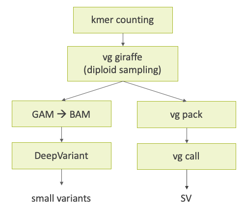

# JGA analysis pangenome short-read genotyping workflow

This workflow performs gemline variant calling from WGS short-read sequencing data using a pangenome reference. The algorithm is mainly based on [Sirén, Jouni, et al. "Personalized pangenome references." Nature Methods 21.11 (2024): 2017-2023.](https://www.nature.com/articles/s41592-024-02407-2) A subgraph of the orignal pangenome is built using the k-mer counts of the target sample, the reads are mapped to the subgraph, and variants are called based on the alignments.

Two types of variants are called: small variants (SNPs and indels) and structural variations.

## Requirements

At least 32 CPUs and 128 GB memory are required to run the workflow. We can execute the workflow using WDL (Workflow Description Language) runner such as Cromwell.

We suppose `/tmp` directory is available on all the nodes in a computing cluster. Genome graph files are temporarily created under `/tmp` at the alignment step.

## Inputs and Outputs

### Inputs

| type    | variable           | description |
| ----    | ----               | ---- |
| String  | `sample_name`      | sample name |
| File    | `read1_fq`         | read1 of paired-end sequencing data |
| File    | `read2_fq`         | read2 of paired-end sequencing data |
| String  | `ref_name`         | reference name (default: `GRCh38`) |
| File    | `ref_fa`           | reference FASTA |
| File    | `ref_fa_fai`       | reference FASTA index |
| File    | `gbz`              | pangenome in GBZ format |
| File?   | `hapl`             | haplotype information of the pangenome (required if `diploid_sampling` is `true`) |
| Boolean | `diploid_sampling` | whether to perform diploid sampling or not. If not, reads are mapped to the original pangenome. The default is `true`. |

### Outputs

| type    | variable                  | description |
| ----    | ----                      | ---- |
| File    | `deepvariant_vcf_gz`      | small variants VCF |
| File    | `deepvariant_vcf_gz_tbi`  | small variants VCF index |
| File    | `deepvariant_gvcf_gz`     | small variants gVCF |
| File    | `deepvariant_gvcf_gz_tbi` | small variants gVCF index |
| File    | `vg_call_vcf_gz`          | structural variations VCF |
| File    | `vg_call_vcf_gz_tbi`      | structural variations VCF index |
